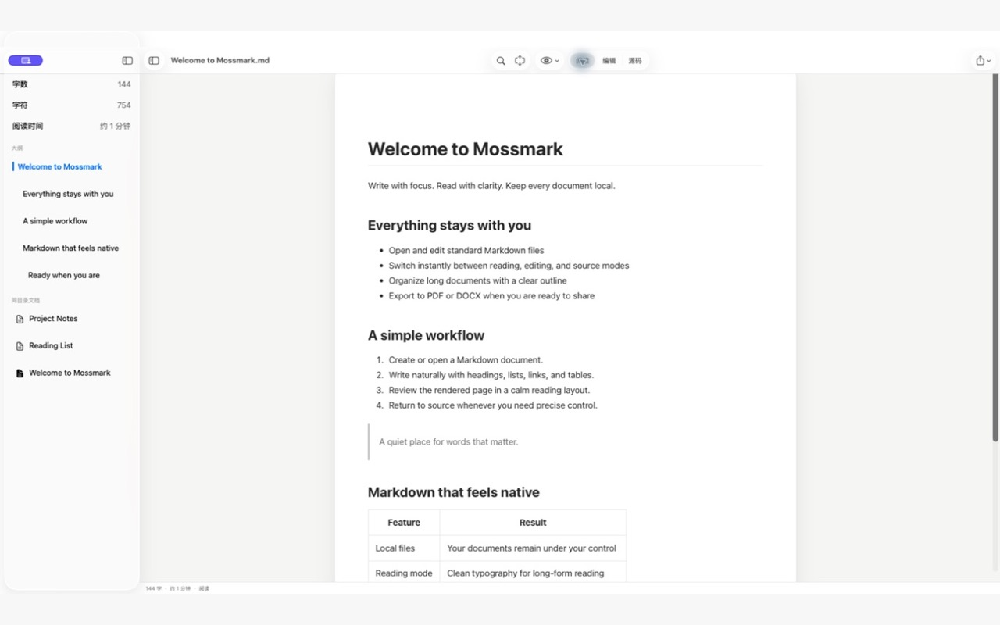
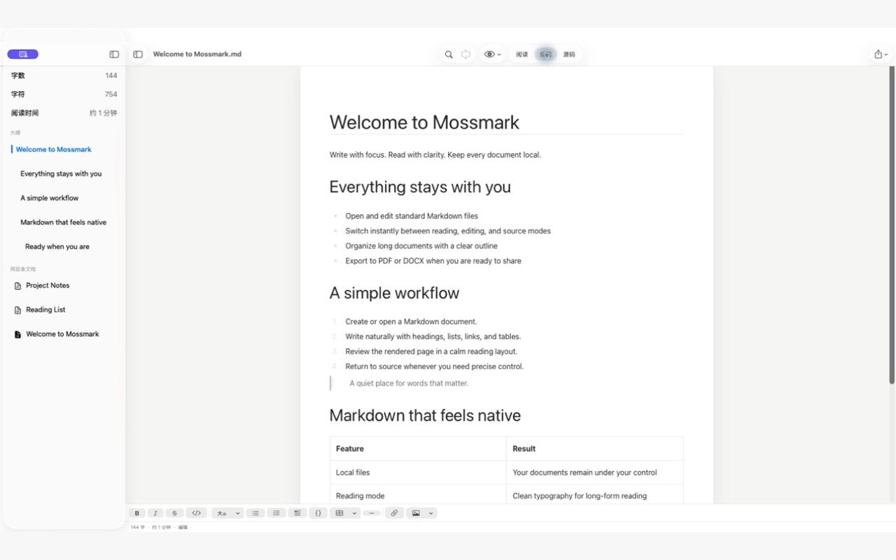
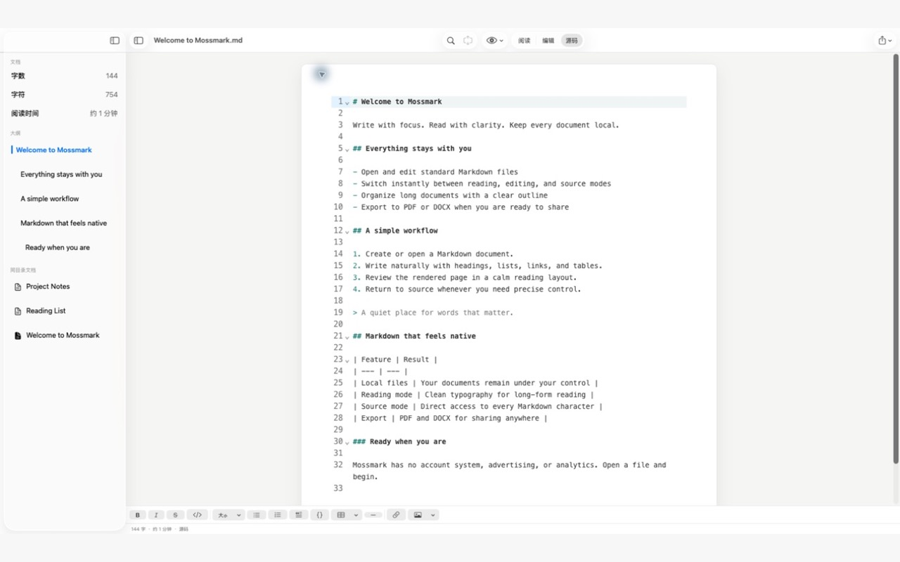
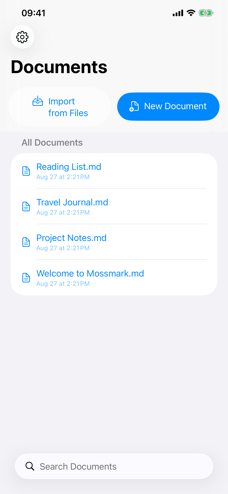
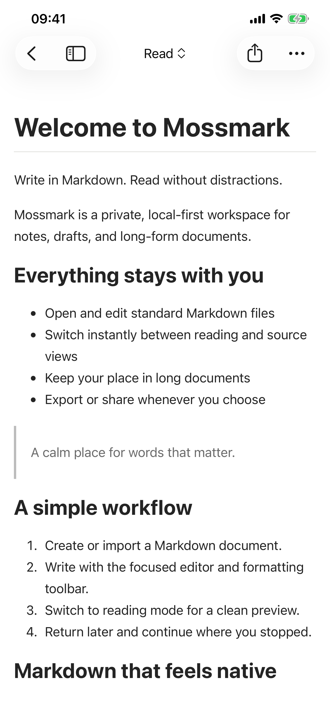
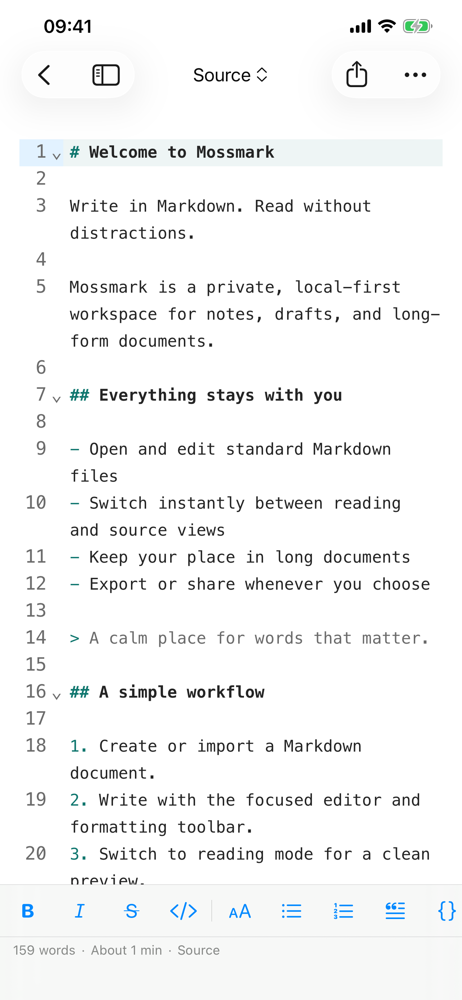
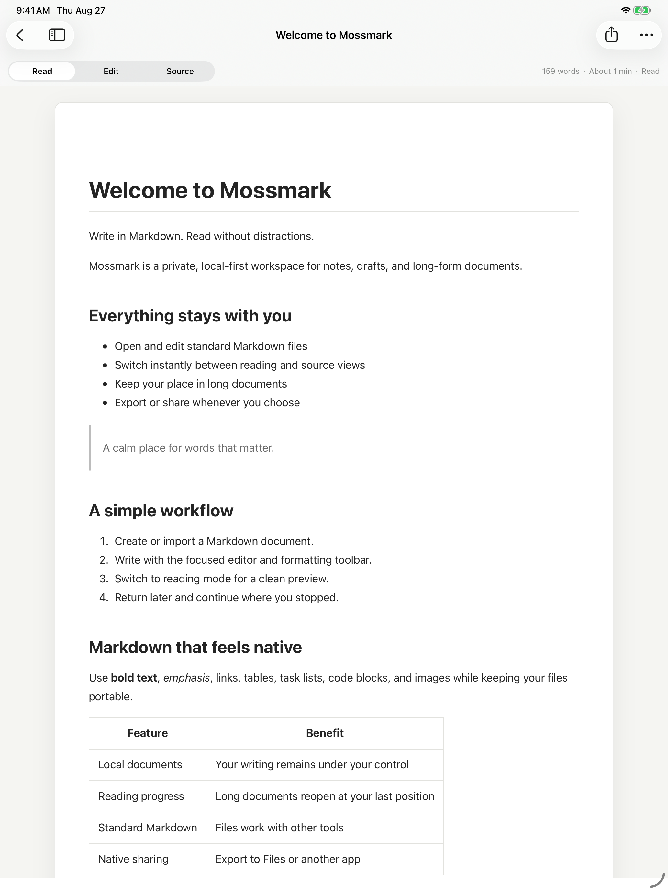

# 苔记 · 本地 Markdown 编辑器

<p align="center">
  
</p>

苔记（Mossmark）是面向 macOS、iPhone 和 iPad 的本地 Markdown 阅读与编辑器，以 MIT 许可证提供源码。原生 Swift 外壳与离线 WKWebView 编辑内核共享文档处理、排版和 PDF/DOCX 导出能力。

下载源码后，可按下方说明自行构建并运行。

## 界面预览

以下演示截图展示阅读、编辑、源码和文档库界面。

### macOS

阅读模式：



<details>
<summary>查看即时编辑和源码模式</summary>

即时编辑：



源码编辑：



</details>

### iPhone

| 文档库 | 阅读 | 源码 |
| --- | --- | --- |
|  |  |  |

### iPad

<details>
<summary>查看 iPad 阅读界面</summary>



</details>

## 功能

- 阅读、即时编辑和源码三种模式；阅读进度、大纲、统计、查找替换、专注及打字机模式；
- GFM 表格与任务状态、代码、KaTeX、Mermaid、脚注和受限安全 HTML 渲染；
- 图片导入到文档相邻的 `images/`，表格行列操作与对齐，静谧、纸张、代码三套排版；
- 无法保证语义往返的内容退回源码编辑；未编辑文档保留原始字节，支持 UTF-8 和带 BOM 的 UTF-16 LE/BE；
- A4 多页 PDF、限定范围的可编辑 DOCX、语义 HTML 导出；
- 简体中文和英文界面，阅读设置、项目链接以及离线许可证查看。

支持范围及尚未完成的人工验收见 [已知限制](docs/KNOWN_LIMITATIONS.md) 和 [验证记录](docs/VALIDATION.md)。

## 文件保存与导入

macOS 使用系统文档窗口打开和保存 Markdown 文件。

iOS/iPadOS 使用 App 内 `Documents/` 文档库，支持新建、导入、重命名、复制和删除。导入会复制 Markdown 文件并避让同名文件；之后编辑的是 App 内副本，不会回写来源文件，也不会自动同步原文件。相邻的图片或其他资源目录不会随 Markdown 导入，含相对图片路径的文档需要另外带入资源或重新插入图片。阅读历史与阅读进度只保存在本机。

卸载 App 前应通过分享或文件 App 备份文档库及关联图片。项目不提供账号、自建云同步、协作、插件市场或 AI 功能。

## 构建与运行

需要 macOS、支持 Swift 6.2 或更新工具链的 Xcode、Node.js 22、pnpm 11.12.0 和 XcodeGen。最低运行系统为 macOS 14、iOS/iPadOS 17。本轮验证使用 Xcode 27、Swift 6.4 和 Node.js 22.15.0。

```bash
cd EditorEngine
pnpm install --frozen-lockfile
pnpm check
pnpm test
pnpm build
cd ..

swift test
node scripts/generate-runtime-legal.mjs
xcodegen generate
scripts/release-preflight.sh

xcodebuild -project Mossmark.xcodeproj -scheme MossmarkMac \
  -destination 'platform=macOS' CODE_SIGNING_ALLOWED=NO build
xcodebuild -project Mossmark.xcodeproj -scheme MossmarkiOS \
  -destination 'generic/platform=iOS Simulator' CODE_SIGNING_ALLOWED=NO build
```

`EditorEngine/dist` 已随源码提交，App 从中加载离线资源；修改前端后需要重新构建。第三方声明生成依赖已安装的前端依赖及 `.build/checkouts/ZIPFoundation`，来源说明见 [第三方许可证](docs/licenses/README.md)。

在 Xcode 中打开 `Mossmark.xcodeproj`，选择 `MossmarkMac` 或 `MossmarkiOS` Scheme 运行。iPhone/iPad 真机运行需要选择自己的 Development Team。自行签名时可在 `project.yml` 修改两个应用目标的 Bundle ID，再重新生成工程。更换标识后系统会使用新的应用容器，需要自行迁移文档。

macOS 面向普通用户的安装包应另行完成 Developer ID 签名、公证与安装验证；iOS/iPadOS 当前以源码和自行构建为主要使用方式。参见 [Apple macOS 分发说明](https://developer.apple.com/developer-id/) 和 [个人开发团队说明](https://developer.apple.com/help/account/basics/about-your-developer-account)。

## 数据与安全

- Markdown 文件是持久化真相，导出不会反写源文件；
- 编辑器脚本、字体与渲染资源随 App 离线打包；
- WebView 使用本地 scheme、CSP 和禁网策略，资源解析限制在文档目录内；
- 远程图片、路径穿越及不允许的资源类型被拒绝；外部链接经系统浏览器打开；
- PDF 图表数量不一致时取消导出，避免静默丢图；
- 不执行用户 HTML 脚本，仅渲染受限安全标签。

项目没有广告或分析 SDK。详见 [隐私说明](docs/PRIVACY.md)。

## 目录与参与

```text
Apps/                    macOS、iOS 外壳与共享 SwiftUI/WebKit 层
Branding/                SVG 标志、图标母版与配色说明
EditorEngine/            离线编辑器、渲染器与前端测试
Sources/MarkdownCore/    文档编码、资源隔离、解析和 OOXML 导出
Tests/、UITests/         核心测试、UI 测试与验收语料
docs/architecture/       当前架构决策
docs/release/            依赖 SBOM 与源码核查记录
project.yml              XcodeGen 工程规格
```

问题反馈请使用 [GitHub Issues](https://github.com/Doubixilin/mossmark/issues)，参与修改前请阅读 [贡献说明](CONTRIBUTING.md)。项目中文名称为「苔记」，应用内显示名为 Mossmark。

## 许可证

项目维护者提供的代码、文档、图标和 `Branding/` 素材按 [MIT](LICENSE) 授权；第三方组件及其资源继续遵循各自许可证，见 [第三方声明](THIRD_PARTY_NOTICES.md)。MIT 允许商用和修改后分发，需保留版权及许可声明。名称和标志的使用不应声称衍生版本由原维护者发布或认可。

当前功能、限制和构建方式以本 README、[已知限制](docs/KNOWN_LIMITATIONS.md) 及 [验证记录](docs/VALIDATION.md) 为准。
