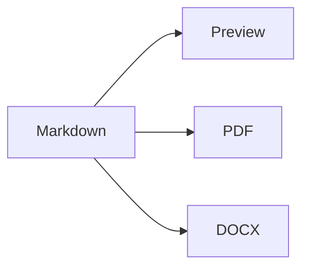

# Markdown 双端验收文档

这是一份用于验证中文、**粗体**、*斜体*、~~删除线~~、`inline code` 与 [安全外链](https://example.com) 的本地文档。

## 清单与引用

- [x] macOS 编译
- [x] iPhone / iPad 模拟器编译
- [ ] Word、Pages、LibreOffice 人工兼容性验收

1. 第一项
2. 第二项

> 编辑器应保持纯 Markdown 文件为唯一持久化真相。

## 表格

| 平台 | 编辑 | PDF | DOCX |
| --- | ---: | ---: | ---: |
| macOS | 是 | 是 | 是 |
| iOS / iPadOS | 是 | 是 | 是 |

## 代码、数学与图表

```swift
struct DocumentState: Sendable {
    let revision: Int
}
```

行内公式 $E = mc^2$，块级公式：

$$
\int_0^1 x^2\,dx = \frac{1}{3}
$$



## 脚注与资源

脚注应在 DOCX 中生成原生脚注关系。[^source]


[^source]: 这是验收脚注；缺失图片必须显示明确占位，不得静默丢弃。

## 原始内容安全回退

<mark>允许的安全标签</mark>

<!-- 注释会触发源码模式安全回退并保持原文。 -->
